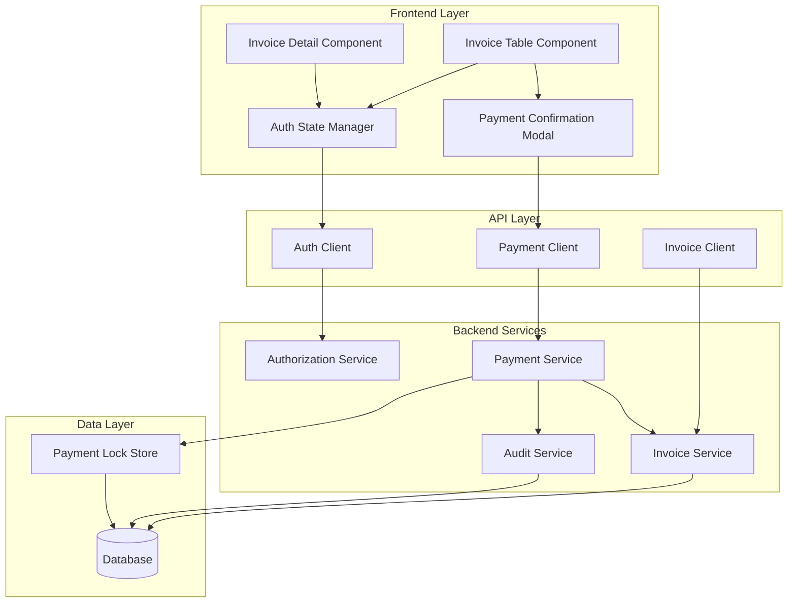
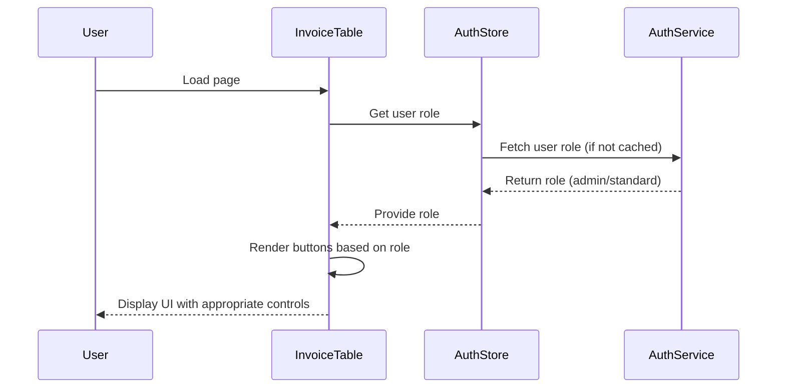
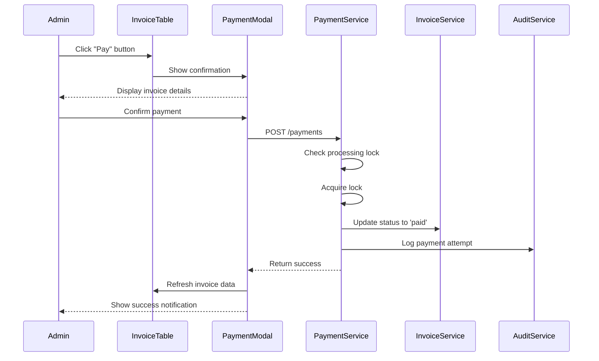

# Design Document: Invoice Payment RBAC

## Overview

This design document specifies the technical architecture for implementing role-based access control (RBAC) for invoice payment functionality within the existing invoice portal application. The feature introduces a direct payment capability for approved invoices, with access restricted based on user roles (Admin vs. Standard users).

### Key Design Goals

1. **Minimal Disruption**: Integrate seamlessly with existing invoice table and detail views
2. **Security First**: Implement robust authorization checks at both frontend and backend layers
3. **User Experience**: Provide clear visual feedback for payment status and role-based capabilities
4. **Performance**: Maintain sub-second response times for authorization checks and payment initiation
5. **Auditability**: Track all payment attempts and authorization decisions

### Context

The invoice portal currently supports invoice management workflows including upload, validation, approval, and rejection. This feature extends the system to enable direct payment processing for approved invoices, with access controlled by user roles. The implementation leverages the existing React + TypeScript frontend, Zustand state management, and React Query for server state.

## Architecture

### High-Level Architecture



### Component Interaction Flow

**Authorization Check Flow:**


**Payment Initiation Flow:**


### Technology Stack Integration

| Layer | Technology | Purpose |
|-------|-----------|---------|
| **State Management** | Zustand | User role and auth state persistence |
| **Server State** | React Query | Invoice data fetching and caching |
| **HTTP Client** | Axios | API communication with interceptors |
| **UI Components** | Existing component library | Button, Modal, Badge, Toast notifications |
| **Type Safety** | TypeScript | End-to-end type safety for roles and permissions |

## Components and Interfaces

### Frontend Components

#### 1. AuthStore (Zustand Store)

**Purpose**: Manage user authentication state and role information

**State Shape**:
```typescript
interface AuthState {
  // User identity
  userId: string | null;
  userEmail: string | null;
  
  // Role information
  userRole: 'admin' | 'standard' | null;
  roleLoadedAt: number | null;
  
  // Loading states
  isLoadingRole: boolean;
  roleError: string | null;
  
  // Actions
  setUserRole: (role: 'admin' | 'standard') => void;
  fetchUserRole: () => Promise<void>;
  clearAuth: () => void;
}
```

**Key Methods**:
- `fetchUserRole()`: Fetches user role from backend, caches for 5 minutes
- `setUserRole()`: Updates role in state and localStorage
- `clearAuth()`: Clears all auth state on logout

**Persistence**: Role cached in localStorage with timestamp for 5-minute TTL

#### 2. Enhanced Invoice Table Component

**Purpose**: Display invoices with role-based payment buttons

**New Props**:
```typescript
interface InvoiceTableProps {
  // Existing props remain unchanged
  invoices: Invoice[];
  isLoading: boolean;
  onInvoiceClick: (id: string) => void;
}
```

**Internal State**:
```typescript
interface InvoiceTableState {
  selectedInvoiceForPayment: Invoice | null;
  showPaymentModal: boolean;
  processingPaymentId: string | null;
}
```

**Rendering Logic**:
- Fetch user role from AuthStore on mount
- For each invoice with status 'approved':
  - If user is admin: Render enabled "Pay" button
  - If user is standard: Render disabled "Pay" button with tooltip
  - If user role is loading: Render skeleton button
- Display payment amount on button

#### 3. Payment Confirmation Modal

**Purpose**: Confirm payment details before processing

**Props**:
```typescript
interface PaymentModalProps {
  isOpen: boolean;
  invoice: Invoice | null;
  onClose: () => void;
  onConfirm: (invoiceId: string) => Promise<void>;
  isProcessing: boolean;
}
```

**Display Elements**:
- Invoice number (large, prominent)
- Vendor name
- Payment amount (formatted with currency)
- Warning text: "This action cannot be undone"
- Cancel button (secondary)
- Confirm button (primary, shows loading state)

**Behavior**:
- Disable confirm button while processing
- Show loading spinner on confirm button during payment
- Close modal on successful payment
- Display error toast on failure (modal remains open)

#### 4. Payment Button Component

**Purpose**: Reusable button for payment actions

**Props**:
```typescript
interface PaymentButtonProps {
  invoice: Invoice;
  userRole: 'admin' | 'standard' | null;
  onClick: () => void;
  isProcessing: boolean;
}
```

**Rendering Logic**:
```typescript
// Pseudo-code
if (invoice.status !== 'approved') return null;

const isDisabled = userRole !== 'admin' || isProcessing;
const tooltipText = userRole === 'standard' 
  ? 'Admin privileges required to process payments'
  : isProcessing 
    ? 'Payment in progress...'
    : 'Click to pay this invoice';

return (
  <Button
    variant="primary"
    size="sm"
    disabled={isDisabled}
    onClick={onClick}
    tooltip={tooltipText}
  >
    {isProcessing ? <Spinner /> : <DollarSign />}
    Pay {formatCurrency(invoice.amountDue, invoice.currency)}
  </Button>
);
```

### Backend API Interfaces

#### 1. Authorization Service API

**Endpoint**: `GET /api/v1/auth/me`

**Response**:
```typescript
interface AuthMeResponse {
  userId: string;
  email: string;
  role: 'admin' | 'standard';
  permissions: string[];
  createdAt: string;
}
```

**Authorization Header**: `Authorization: Bearer <jwt_token>`

**Caching**: Response cached for 5 minutes on frontend

#### 2. Payment Service API

**Endpoint**: `POST /api/v1/payments`

**Request Body**:
```typescript
interface CreatePaymentRequest {
  invoiceId: string;
  amount: number;
  currency: string;
}
```

**Response**:
```typescript
interface CreatePaymentResponse {
  paymentId: string;
  invoiceId: string;
  amount: number;
  currency: string;
  status: 'completed' | 'failed';
  transactionId?: string;
  errorMessage?: string;
  processedAt: string;
}
```

**Error Responses**:
- `400 Bad Request`: Invalid invoice ID or amount
- `401 Unauthorized`: Missing or invalid auth token
- `403 Forbidden`: User lacks admin role
- `409 Conflict`: Invoice already being processed or not in 'approved' status
- `500 Internal Server Error`: Payment processing failure

**Authorization**: Requires `admin` role verified via JWT token

#### 3. Invoice Service API Enhancement

**Endpoint**: `PATCH /api/v1/invoices/:id/status`

**Request Body**:
```typescript
interface UpdateInvoiceStatusRequest {
  status: InvoiceStatus;
  metadata?: {
    paymentId?: string;
    processedBy?: string;
  };
}
```

**Authorization**: Requires `admin` role for status transitions to 'paid'

### Type Definitions

```typescript
// User roles
export type UserRole = 'admin' | 'standard';

// Payment transaction
export interface PaymentTransaction {
  id: string;
  invoiceId: string;
  amount: number;
  currency: string;
  status: 'pending' | 'completed' | 'failed';
  initiatedBy: string;
  transactionId?: string;
  errorMessage?: string;
  createdAt: string;
  completedAt?: string;
}

// Payment lock (for concurrent prevention)
export interface PaymentLock {
  invoiceId: string;
  lockedBy: string;
  lockedAt: string;
  expiresAt: string;
}

// Audit log entry
export interface PaymentAuditLog {
  id: string;
  entityType: 'payment';
  entityId: string;
  eventType: 'payment_initiated' | 'payment_completed' | 'payment_failed' | 'payment_rejected';
  actor: string;
  metadata: {
    invoiceId: string;
    amount: number;
    currency: string;
    userRole: UserRole;
    errorMessage?: string;
  };
  createdAt: string;
}
```

## Data Models

### Database Schema Changes

#### 1. Users Table (New)

```sql
CREATE TABLE users (
  id UUID PRIMARY KEY DEFAULT gen_random_uuid(),
  email VARCHAR(255) UNIQUE NOT NULL,
  role VARCHAR(20) NOT NULL CHECK (role IN ('admin', 'standard')),
  created_at TIMESTAMP DEFAULT NOW(),
  updated_at TIMESTAMP DEFAULT NOW()
);

CREATE INDEX idx_users_email ON users(email);
CREATE INDEX idx_users_role ON users(role);
```

#### 2. Payment Transactions Table (New)

```sql
CREATE TABLE payment_transactions (
  id UUID PRIMARY KEY DEFAULT gen_random_uuid(),
  invoice_id UUID NOT NULL REFERENCES invoices(id),
  amount DECIMAL(15, 2) NOT NULL,
  currency VARCHAR(3) NOT NULL,
  status VARCHAR(20) NOT NULL CHECK (status IN ('pending', 'completed', 'failed')),
  initiated_by UUID NOT NULL REFERENCES users(id),
  transaction_id VARCHAR(255),
  error_message TEXT,
  created_at TIMESTAMP DEFAULT NOW(),
  completed_at TIMESTAMP
);

CREATE INDEX idx_payment_transactions_invoice_id ON payment_transactions(invoice_id);
CREATE INDEX idx_payment_transactions_status ON payment_transactions(status);
CREATE INDEX idx_payment_transactions_initiated_by ON payment_transactions(initiated_by);
```

#### 3. Payment Locks Table (New)

```sql
CREATE TABLE payment_locks (
  invoice_id UUID PRIMARY KEY REFERENCES invoices(id),
  locked_by UUID NOT NULL REFERENCES users(id),
  locked_at TIMESTAMP DEFAULT NOW(),
  expires_at TIMESTAMP NOT NULL
);

CREATE INDEX idx_payment_locks_expires_at ON payment_locks(expires_at);
```

#### 4. Audit Logs Table Enhancement

```sql
-- Add payment-specific event types to existing audit_logs table
ALTER TABLE audit_logs 
  ADD CONSTRAINT check_event_type 
  CHECK (event_type IN (
    -- Existing event types
    'invoice_created', 'invoice_approved', 'invoice_rejected',
    -- New payment event types
    'payment_initiated', 'payment_completed', 'payment_failed', 'payment_rejected'
  ));
```

### Data Relationships

```mermaid
erDiagram
    USERS ||--o{ PAYMENT_TRANSACTIONS : initiates
    USERS ||--o{ PAYMENT_LOCKS : holds
    INVOICES ||--o{ PAYMENT_TRANSACTIONS : has
    INVOICES ||--o| PAYMENT_LOCKS : locked_by
    PAYMENT_TRANSACTIONS ||--o{ AUDIT_LOGS : generates
    
    USERS {
        uuid id PK
        string email
        string role
        timestamp created_at
    }
    
    PAYMENT_TRANSACTIONS {
        uuid id PK
        uuid invoice_id FK
        decimal amount
        string currency
        string status
        uuid initiated_by FK
        string transaction_id
        text error_message
        timestamp created_at
        timestamp completed_at
    }
    
    PAYMENT_LOCKS {
        uuid invoice_id PK_FK
        uuid locked_by FK
        timestamp locked_at
        timestamp expires_at
    }
    
    INVOICES {
        uuid id PK
        string status
        decimal amount_due
    }
    
    AUDIT_LOGS {
        uuid id PK
        string entity_type
        uuid entity_id
        string event_type
        uuid actor
        jsonb metadata
        timestamp created_at
    }
```

## Correctness Properties

*A property is a characteristic or behavior that should hold true across all valid executions of a system—essentially, a formal statement about what the system should do. Properties serve as the bridge between human-readable specifications and machine-verifiable correctness guarantees.*


### Property Reflection

After analyzing all acceptance criteria, I've identified the following areas of redundancy:

**Display Field Properties (1.2-1.8)**: These seven properties all test that specific fields are rendered in the table. They can be consolidated into a single comprehensive property that verifies all required fields are present.

**Button Visibility Properties (2.1-2.2)**: These test opposite conditions (approved vs non-approved). They can be combined into a single property about conditional button rendering based on status.

**Role-Based Button State (4.1 and 5.1)**: These test button enabled/disabled state for different roles. They can be combined into a single property about button state based on user role.

**Payment Initiation and Transaction Creation (4.2 and 4.5)**: Payment initiation always creates a transaction record, so 4.5 is implied by 4.2. These can be combined.

**Confirmation Dialog Elements (6.2 and 6.3)**: Both test that specific elements are present in the confirmation dialog. Can be combined into one completeness property.

**Processing State UI (6.6 and 6.7)**: Both test UI behavior during processing. Can be combined into one property about processing state UI.

**Audit Log Creation and Update (9.1, 9.3, 9.4)**: These test audit log lifecycle. Can be combined into a single property about audit trail completeness.

**Notification Content (7.1, 7.2, 7.3)**: These test notification display and content. Can be combined into properties about notification completeness.

After reflection, the unique properties to test are:

1. Invoice table displays all required fields for all invoices
2. Pay button visibility based on invoice status
3. Pay button state based on user role
4. Payment initiation creates transaction and updates invoice
5. Authorization service provides consistent role information
6. Confirmation dialog completeness
7. Payment processing prevents duplicates
8. Audit trail completeness
9. Notification feedback completeness
10. Pagination behavior for large datasets

### Property 1: Invoice Table Field Completeness

*For any* list of invoices rendered in the Invoice_Table, all required fields (invoice number, vendor name, total amount, amount due, status, invoice date, due date) SHALL be displayed for each invoice.

**Validates: Requirements 1.2, 1.3, 1.4, 1.5, 1.6, 1.7, 1.8**

### Property 2: Pay Button Conditional Rendering

*For any* invoice, the Direct_Pay_Button SHALL be displayed if and only if the invoice status is 'approved'.

**Validates: Requirements 2.1, 2.2**

### Property 3: Pay Button Amount Display

*For any* approved invoice, the Direct_Pay_Button SHALL display the amount to be paid in the button text.

**Validates: Requirements 2.4**

### Property 4: Role-Based Button State

*For any* approved invoice and any user, the Direct_Pay_Button SHALL be enabled if the user role is 'admin' and disabled if the user role is 'standard'.

**Validates: Requirements 4.1, 5.1**

### Property 5: Standard User Access Prevention

*For any* standard user interaction with a disabled Direct_Pay_Button, no payment request SHALL be sent to the Payment_System.

**Validates: Requirements 5.4, 5.5**

### Property 6: Admin Payment Initiation

*For any* admin user clicking the Direct_Pay_Button on an approved invoice, a payment transaction SHALL be initiated and a Payment_Transaction record SHALL be created.

**Validates: Requirements 4.2, 4.5**

### Property 7: Payment Transaction Completeness

*For any* Payment_Transaction record, it SHALL include the invoice identifier, payment amount, timestamp, and transaction status.

**Validates: Requirements 4.6**

### Property 8: Payment Success State Transition

*For any* successful payment transaction, the associated invoice status SHALL be updated to 'paid'.

**Validates: Requirements 4.3**

### Property 9: Confirmation Dialog Completeness

*For any* payment confirmation dialog displayed, it SHALL include the invoice number, vendor name, payment amount, and both confirm and cancel actions.

**Validates: Requirements 6.1, 6.2, 6.3**

### Property 10: Confirmation Cancel Behavior

*For any* admin user selecting the cancel action in the confirmation dialog, the dialog SHALL close and no payment SHALL be initiated.

**Validates: Requirements 6.4**

### Property 11: Confirmation Confirm Behavior

*For any* admin user selecting the confirm action in the confirmation dialog, the Payment_System SHALL initiate the payment transaction.

**Validates: Requirements 6.5**

### Property 12: Processing State UI

*For any* payment in processing state, the Direct_Pay_Button SHALL display a loading indicator and be disabled.

**Validates: Requirements 6.6, 6.7**

### Property 13: Concurrent Payment Prevention

*For any* invoice with an active payment transaction in processing state, additional payment requests for that invoice SHALL be rejected.

**Validates: Requirements 8.1, 8.2**

### Property 14: Processing Lock Cleanup

*For any* payment transaction that completes or fails, the processing lock on the invoice SHALL be removed.

**Validates: Requirements 8.4**

### Property 15: Duplicate Payment Error Message

*For any* rejected duplicate payment request, an error message SHALL be displayed indicating the invoice is already being processed.

**Validates: Requirements 8.3**

### Property 16: Success Notification Completeness

*For any* successful payment, a success notification SHALL be displayed that includes the invoice number and payment amount.

**Validates: Requirements 7.1, 7.3**

### Property 17: Error Notification Completeness

*For any* failed payment, an error notification SHALL be displayed that includes the failure reason and remains visible until dismissed.

**Validates: Requirements 7.2, 7.4**

### Property 18: Payment Success UI Update

*For any* successful payment, the Direct_Pay_Button SHALL no longer be displayed for that invoice.

**Validates: Requirements 7.6**

### Property 19: Audit Trail Completeness

*For any* payment transaction (initiated, completed, or failed), an audit log entry SHALL be created or updated with the user identifier, invoice identifier, timestamp, action type, and status.

**Validates: Requirements 9.1, 9.2, 9.3, 9.4**

### Property 20: Authorization Role Consistency

*For any* user session, multiple requests to the Authorization_Service SHALL return the same role value.

**Validates: Requirements 3.3**

### Property 21: Pagination Limit

*For any* paginated invoice table view, a maximum of 50 invoices SHALL be displayed per page.

**Validates: Requirements 10.3**

### Property 22: Pagination Controls Presence

*For any* invoice table with pagination active, navigation controls SHALL be provided for moving between pages.

**Validates: Requirements 10.4**

### Property 23: Loading State Indicator

*For any* invoice table in loading state, a loading indicator SHALL be displayed.

**Validates: Requirements 10.5**

### Property 24: Table Sorting Correctness

*For any* invoice list sorted by a field (invoice number, vendor name, total amount, or date), the resulting order SHALL be correctly sorted by that field.

**Validates: Requirements 1.10**

## Error Handling

### Frontend Error Handling

#### 1. Authorization Errors

**Scenario**: User role cannot be determined or auth service is unavailable

**Handling Strategy**:
- Display error toast: "Unable to verify user permissions. Please refresh the page."
- Disable all payment buttons (fail closed)
- Log error to console with details
- Retry role fetch after 5 seconds (max 3 retries)
- After 3 failed retries, show persistent error banner

**User Experience**:
- User can still view invoices (read-only mode)
- Clear messaging about why payment actions are unavailable
- Provide manual refresh option

#### 2. Payment Initiation Errors

**Scenario**: Payment API call fails (network error, server error, validation error)

**Handling Strategy**:
- Parse error response for specific error message
- Display error toast with specific message:
  - 400: "Invalid payment request. Please refresh and try again."
  - 401: "Session expired. Please log in again."
  - 403: "You don't have permission to process payments."
  - 409: "This invoice is already being processed."
  - 500: "Payment system unavailable. Please try again later."
- Keep confirmation modal open (allow retry)
- Log error details for debugging
- Remove processing lock if applicable

**User Experience**:
- Clear error messaging with actionable guidance
- Ability to retry without re-entering information
- No data loss (modal stays open)

#### 3. Concurrent Payment Errors

**Scenario**: Multiple users attempt to pay the same invoice simultaneously

**Handling Strategy**:
- Backend acquires lock before processing
- Second request receives 409 Conflict response
- Frontend displays: "This invoice is already being processed by another user."
- Automatically refresh invoice data after 5 seconds
- Update UI to reflect current invoice status

**User Experience**:
- Clear explanation of why action was prevented
- Automatic UI update when processing completes
- No manual intervention required

#### 4. Network Timeout Errors

**Scenario**: Payment request times out (>30 seconds)

**Handling Strategy**:
- Display warning: "Payment is taking longer than expected. Please wait..."
- After 60 seconds, display: "Payment status unknown. Checking..."
- Poll invoice status every 5 seconds (max 12 attempts = 1 minute)
- If status changes to 'paid': Show success message
- If status unchanged: Show error with manual refresh option

**User Experience**:
- Progressive messaging keeps user informed
- Automatic status checking prevents duplicate attempts
- Clear resolution path if status remains unclear

### Backend Error Handling

#### 1. Database Transaction Failures

**Scenario**: Database transaction fails during payment processing

**Handling Strategy**:
- Wrap all payment operations in database transaction
- On failure, rollback all changes (invoice status, payment record, audit log)
- Release payment lock
- Return 500 error with generic message (don't expose internal details)
- Log full error details server-side

**Recovery**:
- Transaction rollback ensures data consistency
- Lock release allows retry
- Audit log records failure for investigation

#### 2. Payment Lock Timeout

**Scenario**: Payment lock held for >60 seconds without completion

**Handling Strategy**:
- Background job runs every 30 seconds
- Identifies locks older than 60 seconds
- Removes stale locks
- Logs timeout event with lock details
- Does NOT change invoice status (requires manual investigation)

**Recovery**:
- Automatic cleanup prevents permanent lock
- Audit trail enables investigation
- Manual review ensures data integrity

#### 3. Invalid Invoice State

**Scenario**: Attempt to pay invoice that's not in 'approved' status

**Handling Strategy**:
- Validate invoice status before acquiring lock
- Return 409 Conflict with message: "Invoice is not in approved status"
- Log attempt with user and invoice details
- Do not create payment transaction record

**Prevention**:
- Frontend prevents UI from showing button for non-approved invoices
- Backend validation provides defense in depth

#### 4. Authorization Failures

**Scenario**: User lacks required role or token is invalid

**Handling Strategy**:
- Validate JWT token signature and expiration
- Check user role from token claims
- Return 401 for invalid/expired token
- Return 403 for insufficient permissions
- Log authorization failure with user ID and attempted action

**Security**:
- Never expose role requirements in error messages
- Generic "insufficient permissions" message
- Detailed logging for security audit

## Testing Strategy

### Testing Approach

This feature requires a **dual testing approach** combining property-based testing for universal behaviors with example-based testing for specific scenarios and integration points.

### Property-Based Testing

**Framework**: fast-check (JavaScript/TypeScript property-based testing library)

**Configuration**:
- Minimum 100 iterations per property test
- Each test tagged with: `Feature: invoice-payment-rbac, Property {number}: {property_text}`
- Seed-based reproducibility for failed tests
- Shrinking enabled for minimal failing examples

**Test Categories**:

1. **UI Rendering Properties** (Properties 1-4, 21-24)
   - Generate random invoice lists with varying statuses, amounts, dates
   - Generate random user roles
   - Verify rendering correctness across all combinations
   - Test with edge cases: empty lists, very large amounts, null dates

2. **Authorization Properties** (Properties 4-5, 20)
   - Generate random user roles and sessions
   - Verify role-based access control
   - Test role consistency across multiple requests
   - Test with invalid/expired tokens

3. **Payment Transaction Properties** (Properties 6-8, 13-15, 19)
   - Generate random payment scenarios
   - Verify transaction creation and state transitions
   - Test concurrent payment prevention
   - Test audit trail completeness

4. **UI Interaction Properties** (Properties 9-12, 16-18, 23)
   - Generate random user interactions
   - Verify modal behavior and button states
   - Test notification display and content
   - Test loading states

**Example Property Test Structure**:
```typescript
import fc from 'fast-check';
import { render } from '@testing-library/react';
import { InvoiceTable } from './InvoiceTable';

// Feature: invoice-payment-rbac, Property 2: Pay Button Conditional Rendering
describe('Property 2: Pay Button Conditional Rendering', () => {
  it('displays pay button if and only if invoice status is approved', () => {
    fc.assert(
      fc.property(
        fc.array(invoiceArbitrary()), // Generate random invoice lists
        (invoices) => {
          const { container } = render(<InvoiceTable invoices={invoices} />);
          
          invoices.forEach(invoice => {
            const payButton = container.querySelector(`[data-invoice-id="${invoice.id}"] .pay-button`);
            
            if (invoice.status === 'approved') {
              expect(payButton).toBeInTheDocument();
            } else {
              expect(payButton).not.toBeInTheDocument();
            }
          });
        }
      ),
      { numRuns: 100 }
    );
  });
});
```

### Example-Based Unit Testing

**Framework**: Vitest (existing project test framework)

**Test Categories**:

1. **Empty State Testing** (Requirement 1.9)
   - Test invoice table with empty array
   - Verify empty state message appears
   - Verify no table rows rendered

2. **Performance Testing** (Requirements 10.1, 10.2)
   - Test render time with 50, 99, 100, 150 invoices
   - Verify pagination triggers at 100+ invoices
   - Measure and assert render time <1 second for <100 invoices

3. **Timing-Based Testing** (Requirements 3.4, 7.5, 8.5)
   - Test role update propagation within 5 seconds
   - Test invoice data refresh within 2 seconds after payment
   - Test payment lock timeout after 60 seconds

4. **Specific Error Scenarios**
   - Test each HTTP error code (400, 401, 403, 409, 500)
   - Verify specific error messages displayed
   - Test network timeout handling

**Example Unit Test Structure**:
```typescript
import { describe, it, expect } from 'vitest';
import { render, screen } from '@testing-library/react';
import { InvoiceTable } from './InvoiceTable';

describe('Invoice Table Empty State', () => {
  it('displays empty state message when no invoices', () => {
    render(<InvoiceTable invoices={[]} />);
    
    expect(screen.getByText(/no invoices found/i)).toBeInTheDocument();
    expect(screen.queryByRole('table')).not.toBeInTheDocument();
  });
});
```

### Integration Testing

**Framework**: Vitest + MSW (Mock Service Worker) for API mocking

**Test Scenarios**:

1. **End-to-End Payment Flow**
   - Admin user views invoice list
   - Clicks pay button on approved invoice
   - Confirms payment in modal
   - Verifies success notification
   - Verifies invoice status updated to 'paid'
   - Verifies pay button removed

2. **Authorization Integration**
   - Test auth service provides role to invoice table
   - Test role changes propagate to UI
   - Test expired token handling

3. **Concurrent Payment Prevention**
   - Simulate two simultaneous payment attempts
   - Verify second attempt receives 409 error
   - Verify appropriate error message displayed

4. **Payment Lock Cleanup**
   - Initiate payment
   - Simulate completion/failure
   - Verify lock removed
   - Verify subsequent payment allowed

**Example Integration Test Structure**:
```typescript
import { describe, it, expect, beforeEach } from 'vitest';
import { render, screen, waitFor } from '@testing-library/react';
import userEvent from '@testing-library/user-event';
import { setupServer } from 'msw/node';
import { http, HttpResponse } from 'msw';
import { InvoiceTable } from './InvoiceTable';

const server = setupServer(
  http.get('/api/v1/auth/me', () => {
    return HttpResponse.json({ role: 'admin' });
  }),
  http.post('/api/v1/payments', () => {
    return HttpResponse.json({ status: 'completed' });
  })
);

beforeEach(() => server.listen());

describe('Payment Flow Integration', () => {
  it('completes full payment flow for admin user', async () => {
    const invoice = { id: '1', status: 'approved', amountDue: 1000 };
    render(<InvoiceTable invoices={[invoice]} />);
    
    // Click pay button
    const payButton = await screen.findByText(/pay/i);
    await userEvent.click(payButton);
    
    // Confirm in modal
    const confirmButton = await screen.findByText(/confirm/i);
    await userEvent.click(confirmButton);
    
    // Verify success notification
    await waitFor(() => {
      expect(screen.getByText(/payment successful/i)).toBeInTheDocument();
    });
    
    // Verify pay button removed
    expect(screen.queryByText(/pay/i)).not.toBeInTheDocument();
  });
});
```

### Manual Testing Checklist

**UI/UX Testing**:
- [ ] Pay button visually distinct and clearly labeled
- [ ] Disabled button has appropriate visual styling
- [ ] Tooltip appears on hover for disabled button
- [ ] Confirmation modal is centered and readable
- [ ] Loading indicators are smooth and visible
- [ ] Success/error notifications are prominent
- [ ] Empty state message is helpful

**Accessibility Testing**:
- [ ] Pay button has appropriate ARIA labels
- [ ] Disabled button has aria-disabled attribute
- [ ] Modal has proper focus management
- [ ] Keyboard navigation works for all interactions
- [ ] Screen reader announces button states
- [ ] Color contrast meets WCAG AA standards

**Cross-Browser Testing**:
- [ ] Chrome (latest)
- [ ] Firefox (latest)
- [ ] Safari (latest)
- [ ] Edge (latest)

**Responsive Testing**:
- [ ] Desktop (1920x1080)
- [ ] Laptop (1366x768)
- [ ] Tablet (768x1024)
- [ ] Mobile (375x667)

### Test Coverage Goals

- **Unit Tests**: 90%+ code coverage
- **Integration Tests**: All critical user flows covered
- **Property Tests**: All 24 properties implemented
- **Manual Tests**: All checklist items verified

### Continuous Integration

**Pre-Commit**:
- Run linter (ESLint)
- Run type checker (TypeScript)
- Run fast unit tests (<5 seconds)

**Pre-Push**:
- Run all unit tests
- Run all property tests
- Verify test coverage thresholds

**CI Pipeline**:
- Run full test suite
- Generate coverage report
- Run build verification
- Deploy to staging environment

## Implementation Notes

### Phase 1: Foundation (Week 1)

1. **Backend Setup**
   - Create database migrations for users, payment_transactions, payment_locks tables
   - Implement Authorization Service with JWT validation
   - Create user role management endpoints
   - Set up audit logging infrastructure

2. **Frontend Setup**
   - Create AuthStore with Zustand
   - Implement auth API client
   - Add role fetching logic with caching

### Phase 2: Core Payment Features (Week 2)

1. **Payment API**
   - Implement payment initiation endpoint
   - Add payment lock mechanism
   - Integrate with invoice status updates
   - Add audit logging for all payment events

2. **UI Components**
   - Create PaymentButton component
   - Create PaymentConfirmationModal component
   - Enhance InvoiceTable with payment buttons
   - Add loading and error states

### Phase 3: Authorization Integration (Week 3)

1. **Role-Based Access Control**
   - Integrate AuthStore with InvoiceTable
   - Implement button enable/disable logic
   - Add tooltip for disabled buttons
   - Prevent API calls for standard users

2. **Error Handling**
   - Implement all error scenarios
   - Add retry logic for transient failures
   - Create user-friendly error messages
   - Add error logging

### Phase 4: Testing & Polish (Week 4)

1. **Testing**
   - Write all property-based tests
   - Write example-based unit tests
   - Write integration tests
   - Perform manual testing

2. **Polish**
   - Refine UI/UX based on feedback
   - Optimize performance
   - Add accessibility improvements
   - Update documentation

### Migration Strategy

**Database Migrations**:
- Run migrations in staging environment first
- Verify data integrity
- Run migrations in production during low-traffic window
- Monitor for errors

**Feature Rollout**:
- Deploy backend changes first (backward compatible)
- Deploy frontend changes with feature flag
- Enable for internal users first (beta testing)
- Gradually roll out to all users
- Monitor error rates and performance

### Security Considerations

1. **Authentication**
   - Use JWT tokens with short expiration (15 minutes)
   - Implement refresh token mechanism
   - Validate token signature on every request

2. **Authorization**
   - Check user role on backend for every payment request
   - Never trust frontend role information
   - Log all authorization failures

3. **Payment Security**
   - Use HTTPS for all API communication
   - Implement CSRF protection
   - Add rate limiting for payment endpoints (max 10 requests/minute per user)
   - Validate invoice status before processing payment

4. **Audit Trail**
   - Log all payment attempts (success and failure)
   - Include user ID, IP address, timestamp
   - Store logs in tamper-proof storage
   - Retain for minimum 365 days

### Performance Optimization

1. **Frontend**
   - Cache user role for 5 minutes
   - Use React.memo for InvoiceTable rows
   - Implement virtual scrolling for large invoice lists
   - Lazy load payment modal component

2. **Backend**
   - Index database tables appropriately
   - Use connection pooling
   - Implement query result caching
   - Add database query monitoring

3. **API**
   - Implement request debouncing
   - Use optimistic updates for better UX
   - Add response compression
   - Monitor API response times

### Monitoring & Observability

**Metrics to Track**:
- Payment success rate
- Payment failure rate by error type
- Average payment processing time
- Authorization check latency
- Concurrent payment attempt frequency
- Lock timeout frequency

**Alerts**:
- Payment failure rate >5%
- Authorization service unavailable
- Payment processing time >5 seconds
- Lock timeout rate >1%

**Logging**:
- All payment attempts (success/failure)
- All authorization checks
- All lock acquisitions and releases
- All API errors

## Conclusion

This design provides a comprehensive, secure, and user-friendly implementation of role-based access control for invoice payment functionality. The architecture leverages existing infrastructure while adding minimal complexity, and the testing strategy ensures correctness through property-based testing combined with targeted example-based tests.

The phased implementation approach allows for incremental delivery and validation, while the security and monitoring considerations ensure the feature operates reliably in production.
